# Taller 12

### Power BI

##### Analítica Computacional para la Toma de Decisiones

---

|     Nombres      |      Apellidos       |     Login     |  Codigo   |
| :--------------: | :------------------: | :-----------: | :-------: |
|     Santiago     | Gonzalez Montealegre | s.gonzalez35  | 202012274 |
| Juliana Carolina |  Cardenas Barragan   | jc.cardenasb1 | 202011683 |

---

---

## Pre-requisitos

---

```
= Table.TransformColumnTypes(#"Encabezados promovidos",{{"Country", type text}, {"Subject Descriptor", type text}, {"Units", type text}, {"Scale", type text}, {"Year", Int64.Type}, {"GDP", type any}})
```

Data type

- Country: text
- Year: Int64.Type
- GDP: Any

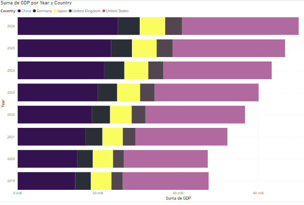

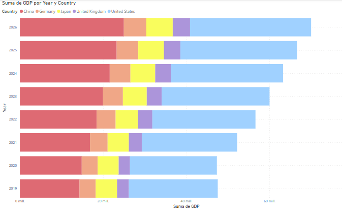

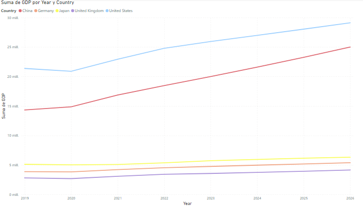

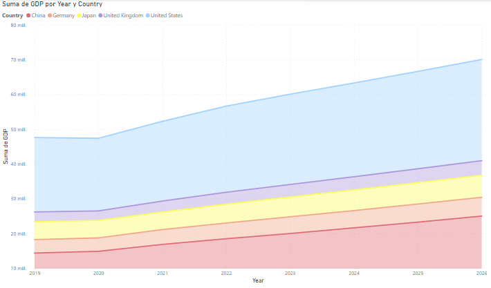

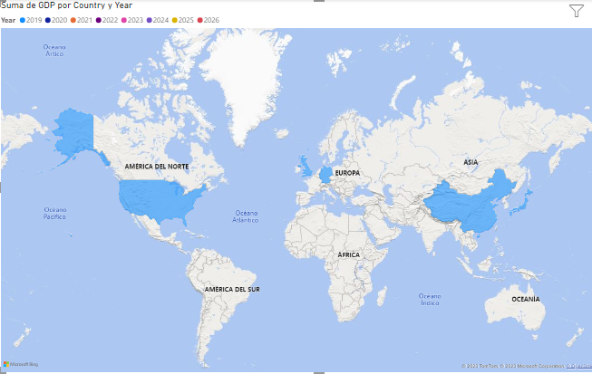

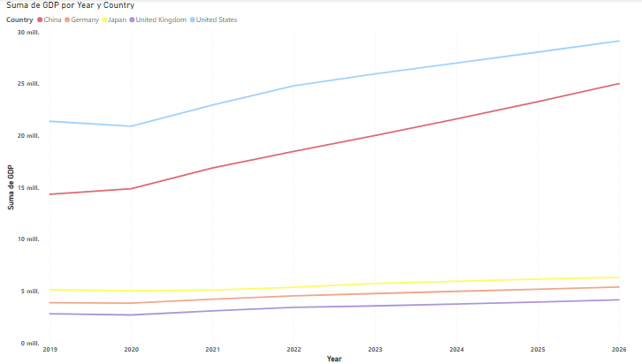

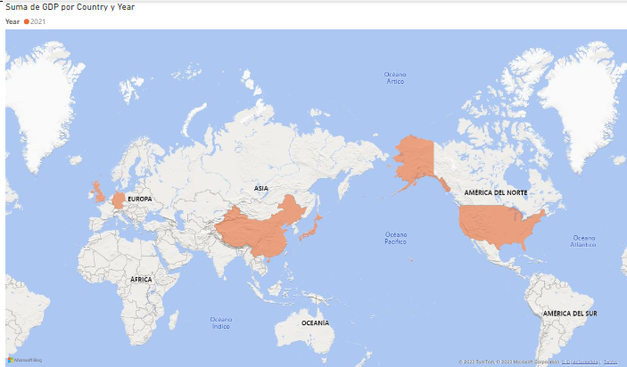

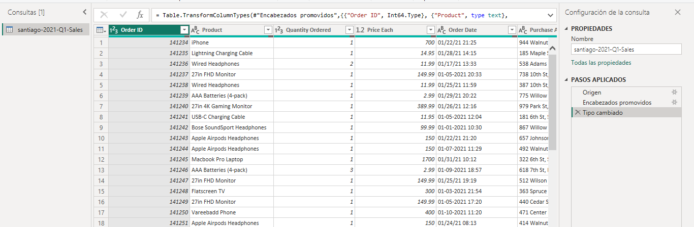

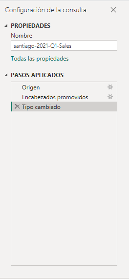

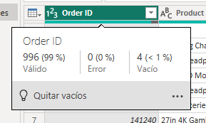

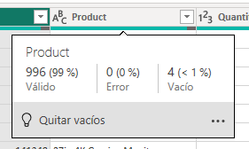

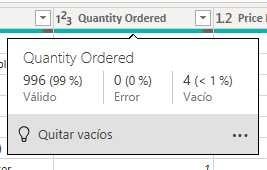
