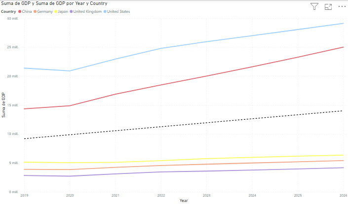
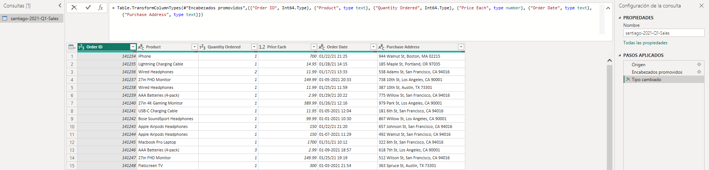
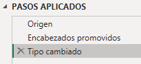
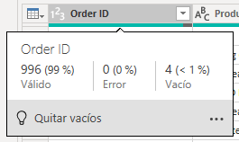
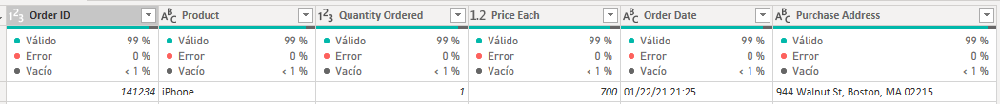
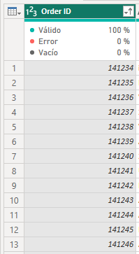
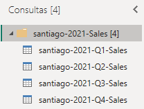
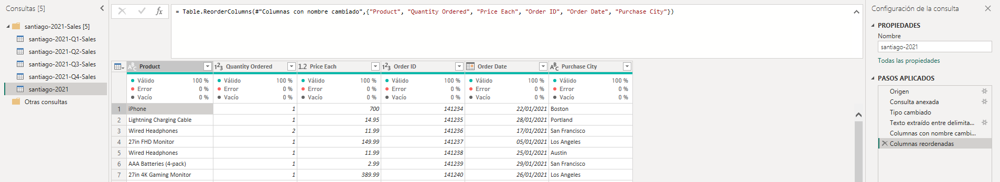

# Taller 13

### Power BI

##### Analítica Computacional para la Toma de Decisiones

---

|     Nombres      |      Apellidos       |     Login     |  Codigo   |
| :--------------: | :------------------: | :-----------: | :-------: |
|     Santiago     | Gonzalez Montealegre | s.gonzalez35  | 202012274 |
| Juliana Carolina |  Cardenas Barragan   | jc.cardenasb1 | 202011683 |

---

---

## Pre-requisitos

---

1. Para esta sesión va a requerir una cuenta de Power BI Desktop. Para esto hay varias opciones:
   1. Si tiene un computar Windows, instale Power BI desde la página https://powerbi.microsoft.com/en-us/downloads/ empleando el enlace Downloads en la sección Power BI Desktop.
   2. Ingrese a Nukak tareas https://tecnologia.uniandes.edu.co/nukak-tareas/ y seleccione Power BI Desktop.
2. Nota: la entrega de este taller consiste en un reporte y unos archivos de soporte. Cree el archivo de su reporte como un documento de texto en el que pueda fácilmente incorporar capturas de pantalla, textos y similares. Puede ser un archivo de word, libre office, markdown, entre otros.

---

---

## Primeros pasos: conectando y visualizando datos

---

### 1.

En la página inicial vaya a Archivo y Opciones y configuración. Seleccione Opciones.

---

### 2.

En el panel izquierdo seleccione Archivo Actual, Configuración regional y en la lista seleccione Español (Colombia). De acuerdo con los datos que contemos, podemos ajustar esta configuración regional al formato disponible.

---

### 3.

Descargue de BN los datos `gdp-per-countr.xlsx`.

---

### 4.

En la página principal de Power BI seleccione Obtener datos. Click en Más... y observe todos los tipos disponibles de fuentes de datos.

---

### 5.

Seleccione Libro de Excel (formato de los datos descargados) y seleccione los datos descargados.

---

### 6.

Note que puede seleccionar cada hoja del archivo. Seleccione la Hoja 1.

---

### 7.

Allí puede observar un preview de los datos. De click en Transformar.

---

### 8.

En esta etapa puede transformar los datos antes de proceder a realizar visualizaciones. Note que en la barra de comandos hay un comando que describe la creación de la tabla con los tipos de cada columna. Copie este comando en su reporte.

```sql
= Table.TransformColumnTypes(
   #"Encabezados promovidos",
   {
      {"Country", type text},
      {"Subject Descriptor", type text},
      {"Units", type text},
      {"Scale", type text},
      {"Year", Int64.Type},
      {"GDP", type any}
   }
)
```

---

### 9.

Inicialmente solo nos interesan las columnas Country, Year y GDP. Para las demás columnas puede seleccionar cada una y eliminarlas con un click en Inicio, Quitar Columna.

---

### 10.

Note que al quitar una columna, el comando en la barra de comandos cambia y a la derecha se listan los pasos aplicados (en la barra Configuración de consulta). Cada paso corresponde a un comando y si quiere deshacer un paso puede hacerlo dando click en la equis que aparece a la izquierda de cada paso.

---

### 11.

También puede quitar las columnas marcándolas y con un click derecho mostrar un menú que incluye la opción de quita columnas.

---

### 12.

Note que en la columna GDP tenemos valores n/a. Para eliminarlos haga click en el botón con una flecha a la derecha del nombre de la columna. Allí aparece un filtro, busque el valor n/a y quite la selección. Click en Aceptar.

---

### 13.

Considere ahora los tipos de cada columna, lístelos en su reporte.

**Data type**

- **Country:** text
- **Year:** Int64.Type
- **GDP:** Any

---

### 14.

Como el tipo de la columna GDP es de caracteres y números, de click derecho sobre la columna, seleccione Cambiar tipo y Número entero.

---

### 15.

Con estos cambios puede hacer click en Cerra y aplicar (arriba a la izquierda) para aplicar estos cambios al dataset.

---

### 16.

Al volver a la ventana principal, a la izquierda tiene tres vistas: informe, datos y modelo. Seleccione vista de datos.

---

### 17.

A la derecha debe aparecer el dataset conectado. Haga click derecho para cambiar el nombre y asigne un nombre apropiado.

---

### 18.

Seleccione la vista de visualización. A la derecha puede ver un listado de las visualizaciones disponibles, así como los datos y los filtros. Seleccione una gráfica de barras horizontales.

---

### 19.

Haga click sobre la gráfica vacía recién creada y arrastre el campo Year a la caja Eje X de Visualizaciones.

---

### 20.

Arrastre también el campo GDP a la caja Eje Y.

---

### 21.

Note que esta gráfica muestra la suma de GDP por año observado. Para observar cada país por separado arrastre el campo Country a la caja Leyenda.

---

### 22.

Para filtrar los 5 países con el mayor GDP promedio, en Filtros seleccione la tarjeta de Country, defina el Tipo de filtro como Top, Superior y para mostrar 5 elementos. A la caja Por valor arrastre el campo GDP y seleccione promedio como función de agregación. Click en aplicar filtro.

---

### 23.

Tome un pantallazo a la gráfica obtenida e inclúyalo en su reporte.


---

### 24.

Este gráfico no es muy agradable, pero hay múltiples alternativas que puede seleccionar fácilmente con un click en la gráfica y seleccionando una visualización en el menú de la derecha. Seleccione 3 diferentes a manera de prueba, ajuste los colores (en la pestaña Formato) e inclúyalas en su reporte. Si tiene problemas con los mapas, vaya a Archivo, Opciones y configuración, Opciones, seleccione Seguridad en el menú de la izquierda y marque Uso de elementos visuales y mapa cloroplético.


---

### 25.

En particular, cree una gráfica de líneas que muestre desde el año 2019 al 2026 el GDP de los 5 países con el mayor GDP promedio. En el menú de Visualizaciones, seleccione el ícono del medio (Dar formato a su objeto visual) y allí ponga las etiquetas de los ejes en negrita y elimine las líneas de cuadrícula.

---

### 26.

En el menú de Visualizaciones, seleccione el ícono de la derecha (Agregar más análisis a sus objetos visuales) y allí agregue una línea de tendencia en un color reconocible y lo línea a trozos.

---

### 27.

Cree ahora un mapa cloroplético con la misma serie y ajústelo según considere. Note que en este caso solo queremos mostrar una serie, por lo cual puede ir a Filtros y en Year use un filtro básico para seleccionar un año de interés.

---

### 28.

Incluya un pantallazo de su objeto visual (con por lo menos la gráfica de líneas y el mapa) en su reporte.




---

### 29.

Guarde su proyecto para incluirlo como soporte de este taller.

- **Nombre Archivo**: `GDP.pbix`

---

---

## Trabajando con datos

---

### 1.

Descargue ahora los datos de ventas de BN. Son varios archivos en formato CSV.

---

### 2.

En Power BI inicie un nuevo proyecto con un click en Archivo, Nuevo.

---

### 3.

En la ventana principal click en Transformar datos en el menú superior. Esto abre una ventana del Power Query editor.

---

### 4.

En el menú superior click en Nuevo origen y seleccione Texto o CSV.

---

### 5.

Navegue a la ubicación de los archivos descargados (descomprimidos) y seleccione el archivo del primer trimestre (Q1).

---

### 6.

Aquí puede pre-visualizar los datos. Note que aquí puede ajustar el formato de originen, el delimitador y cómo se realiza la detección del tipo de datos. Click en Aceptar para agregar esta fuente de datos. De aquí en adelante todos los cambios se realizan en Power BI, sin modificar el archivo original.

---

### 7.

Explore brevemente el menú de opciones del Power Query editor. Note que en la pestaña Vista puede configurar algunos ítems de la vista, como el panel de Configuración de Consulta o la Barra de Fórmulas.

---

### 8.

En el panel de Configuración de consulta puede cambiar el nombre de la consulta. Cámbielo para incluir su nombre al inicio, e.g., juan-2021-q1-sales. Verifique que el cambio se muestre en el panel Consultas de la izquierda. Tome un pantallazo e inclúyalo en su reporte.

- **Nombre Consulta:** `santiago-2021-Q1-Sales`



---

### 9.

Identifique los pasos aplicados hasta el momento en la consulta y descríbalos en su reporte.



- **Origen**

```sql
= Csv.Document(
   File.Contents("C:\Users\SGM\Documents\Analytics\Talleres\Taller13\Data\2021-Sales\2021-Q1-Sales.csv"),
   [
      Delimiter=",",
      Columns=6,
      Encoding=1252,
      QuoteStyle=QuoteStyle.None
   ]
)
```

Se cargan los datos, se muestra la dirección física del archivo en memoria. Además, ciertas características para leer el archivo como el delimitador, el número de columnas, la forma en que están codificados los datos.
Los datos cargados con estas condiciones son almacenados en la variable `Origen`.

- **Encabezados promovidos**

```sql
= Table.PromoteHeaders(
   Origen,
   [
      PromoteAllScalars=true
   ]
)
```

Esta función se utiliza para promover las filas superiores de una tabla o archivo como encabezados de la columna. Esta función usa los datos de la variable `Origen` y los transforma, esta transformación se guarda en la variable `Encabezados promovidos`.

- **Tipo cambiado**

```dax
= Table.TransformColumnTypes(
   #"Encabezados promovidos",
   {
      {"Order ID", Int64.Type},
      {"Product", type text},
      {"Quantity Ordered", Int64.Type},
      {"Price Each", type number},
      {"Order Date", type text},
      {"Purchase Address", type text}
   }
)
```

En esta función se define el tipo de dato que almacena cada una de las columnas, se definen sobre los datos en la variable `Encabezados promovidos`. Estos datos finales donde las columnas tienen definido el tipo de dato se guardan en la variable `Tipo cambiado`.

---

### 10.

Note que cada columna tiene una barra verde. Ubique el cursor sobre la barra y observe el número de datos correctos, con errores y vacíos en cada columna. Documente esto en su reporte. Note que esto está basado en las primeras 1000 filas.



Al ubicar el cursor se observa de la siguiente forma. Sin embargo, para evitar tener que ubicar el cursor en cada una de las columnas se puede habilitar la opción `Calidad de columnas` en la sección `Vista`.



---

### 11.

Para eliminar los vacíos seleccione una columna con vacíos, en el menú superior, pestaña Inicio click en Quitar filas y Quitar filas en blanco. Note la actualización en el panel de Configuración de consulta.

---

### 12.

Seleccione ahora la Columna Order ID. Note que el tipo es numérico. Haciendo click en el botón a la izquierda del nombre, seleccione ordenamiento descendente. Esto debe causar un error de tipo.

---

### 13.

Para identificar este error, en Pasos aplicados haga click en Encabezados promovidos, justo antes de Tipo cambiado. Note que regresa a una versión anterior de los datos, donde no se habían cambiado los tipos y todas las columnas son alfanuméricas.

---

### 14.

Ordene nuevamente descendentemente por la columna Order ID. Responda Sí a la pregunta sobre si quiere agregar un paso intermedio. Note que este ordenamiento revela que la columna Order ID es alfanum´erica. Con un click en el filtro de la columna Order ID use el filtro para buscar quitar todas las filas con valor Order ID.

---

### 15.

Regrese al último paso de la consulta (Filas ordenadas) y verifique que la consulta funciona correctamente. Aplique un ordenamiento ascendente sobre la columna Order ID, tome un pantallazo e inclúyalo en su reporte.



---

### 16.

Guarde su proyecto y deje los cambios en las consultas para aplicar más tarde.

---

### 17.

Note que la columna Order date está en formato de Estados Unidos. De click derecho sobre el nombre de la columna, click en Cambiar tipo, Usar configuración regional, seleccione Inglés (Estados Unidos) y Tipo de datos Fecha/Hora.

---

### 18.

Para agregar nuevas fuentes de datos, sabiendo que tienen el mismo formato y queremos aplicar las mismas transformaciones, click en derecho en la Consulta actual y Duplicar.

---

### 19.

Note que la nueva consulta tiene los mismos datos y transformaciones de la anterior. Cambie el nombre para que se refiera a Q2. En el primer paso aplicado, Origen, click en el piñón y en Ruta de acceso de archivo seleccione el archivo que se refiere a Q2. Click en Aceptar y verifique que los datos de las dos consultas efectivamente hacen referencia a Q1 y Q2.

---

### 20.

Repita el paso anterior para Q3 y Q4, y asegúrese que los datos corresponden a estos trimestres.

---

### 21.

Note que existe una opción alternativa a ésta, Referencia, la cual no crea una copia de los pasos sino que toma como fuente el resultado de la consulta referenciada. Sin embargo, en este caso no es útil pues queremos aplicar los mismos pasos a cada archivo fuente.

---

### 22.

Cree ahora un grupo de consultas haciendo click derecho en el panel de Consultas y creando un nuevo grupo. Asigne un nombre que incluya su primer nombre.

---

### 23.

Seleccione las 4 consultas creadas y arrástrelas al grupo creado. Tome un pantallazo e inclúyalo en su reporte.



---

### 24.

En la pestaña Inicio busque Anexar consultas en la parte derecha, click en la flecha y seleccione Anexar consultas para crear una nueva. Mantenga la selección en Dos tablas y seleccione las de Q1 y Q2. Click en aceptar.

---

### 25.

La nueva Consulta contiene una mezcla de las dos tablas. Asígnele un nombre que elimine la referencia a los trimestres y quede solo a 2021.

---

### 26.

Sobre la nueva consulta, click en Anexar consultas, marque Tres o más tablas y a la tabla nueva agregue las de Q3 y Q4.

---

### 27.

Revise los tipos de datos de las columnas. Es posible que Order Date no se encuentre como tipo fecha sino como alfanumérico. Realice el paso anterior de cambiar el tipo usando configuración regional.

---

### 28.

Ahora añada un nuevo paso en el que cambie el tipo de Order Date a solo Fecha.

---

### 29.

Ordene los datos ascendentemente por fecha.

---

### 30.

Ahora queremos extraer la ciudad de la columna Purchase Address (es la segunda parte de la dirección, entre dos comas). En la Pestaña Transformar seleccione Extraer y la opción texto entre delimitadores.

---

### 31.

Como delimitador de inicio marque una coma seguida de un espacio, y como delimitador de fin una coma. Click en Aceptar.

---

### 32.

Revise que el cambio haya sido exitoso.

---

### 33.

Renombre el nombre de la columna por Purchase city (doble click sobre el nombre).

---

### 34.

Reordene las columnas para dejar a la izquierda los datos de la orden y a la derecha los del producto (nombre, cantidad y precio del producto).

---

### 35.

Tome un pantallazo de la tabla actualizada e inclúyalo en su reporte.



---

### 36.

Guarde su proyecto.

- **Nombre Archivo**: `Sales.pbix`
